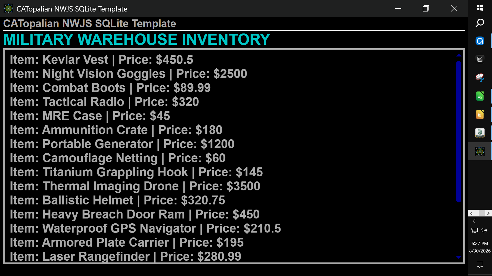
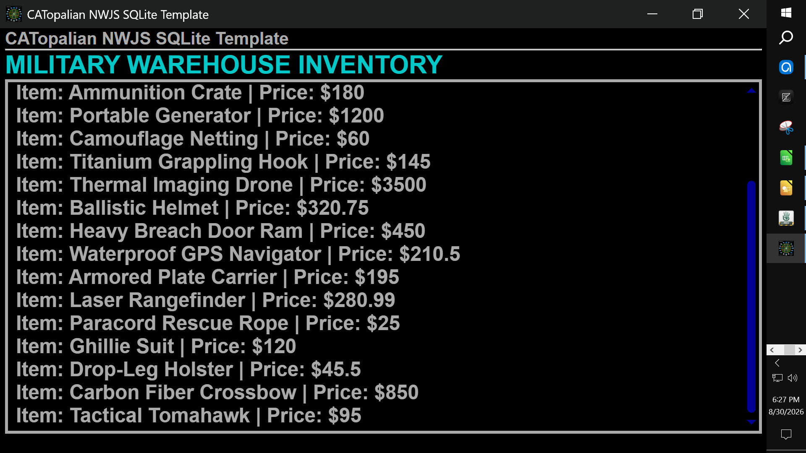
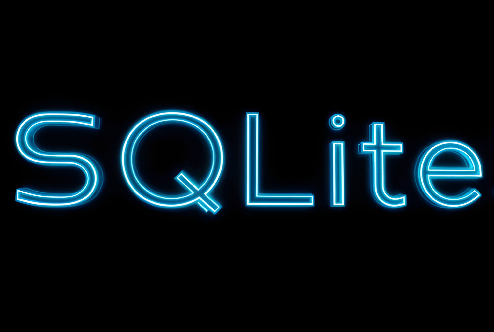

# CATopalian NWJS SQLite Template
Learn the secrets to the SQLite universe using Node.js and NW.js for a beautiful graphical user interface database experience!

---

REQUIREMENTS:
* Node.js https://nodejs.org/en

* NW.js https://nwjs.io/  

---

To run this application we:
* Download NW.js
* Extract All
* Find the nw.exe icon
* Drag the folder named **app** onto the nw.exe icon  

Full Instructions on Running our app here: https://github.com/ChristopherAndrewTopalian/CATopalian_JavaScript_NW.js

---

---

### How to Download this App
1. Click the green Code Button on this github page
2. Choose Download ZIP
3. Save the Zip File
4. Extract All
5. Drag the folder named **app** onto the nw.exe icon 

---

Happy Scripting :-)

---

// Dedicated to God the Father  
// All Rights Reserved Christopher Andrew Topalian Copyright 2000-2026  
// https://github.com/ChristopherAndrewTopalian  
// https://github.com/ChristopherTopalian  
// https://sites.google.com/view/CollegeOfScripting

